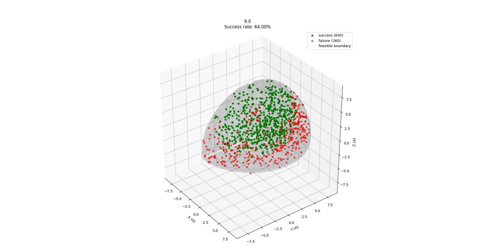
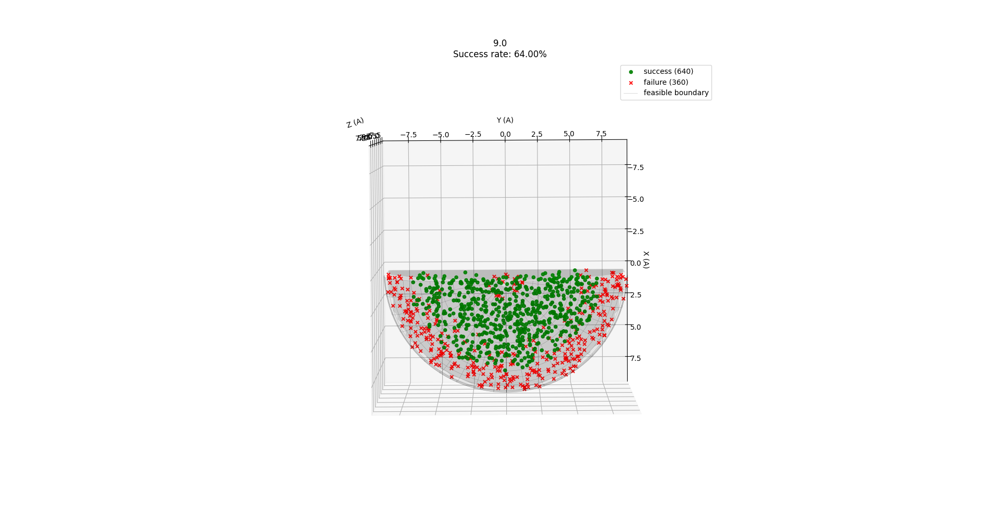

# Robotic Arm Path Planning using Gauss–Newton Optimization

## 🧠 Overview

This project implements a **3-link robotic arm path-planning algorithm** using forward kinematics and an iterative **Gauss–Newton (Levenberg–Marquardt)** optimization method to reach randomly distributed 3D target points within a reachable workspace.

The system simulates a 4-DoF arm (base yaw + 3 pitch joints) with realistic **joint limits**, **kinematic constraints**, and **region filtering** for valid targets. The optimization converges to a feasible configuration that minimizes the Cartesian distance between the arm’s end effector and each target point.

---

## ⚙️ Core Functionality

| Function | Description |
|-----------|--------------|
| `yaw_pitch_quat(yaw, pitch)` | Builds a rotation quaternion \( R_z(yaw) * R_y(pitch) \). |
| `fk_ABCD(psi_A, theta_A, theta_B, theta_C)` | Computes **forward kinematics** of the arm — returning origins and rotations of all segments. |
| `cost_J()` | Cost function \( J(q) = ||p(q) - p_{target}||^2 + \lambda * \text{penalties} \). |
| `fd_position_jacobian_reduced()` | Finite-difference Jacobian of the end-effector position with respect to joint angles. |
| `gn_delta_q_reduced()` | Damped Gauss–Newton update rule for local optimization. |
| `seed_arm_angles_from_target()` | Generates an initial feasible seed configuration based on geometry and joint limits. |
| `plan_robot_path()` | Iteratively moves the arm to minimize position error until convergence. |
| `path_planning_algorithm_analysis()` | Samples hundreds of random targets in the reachable workspace and evaluates success rate, convergence speed, and final error distribution. |
| `plot_target_outcomes()` | Visualizes successful (green) vs failed (red) target convergence in 3D. |

---

## 🧩 Algorithm Summary

1. **Target Sampling**  
   Random target points are sampled inside a hemisphere where \( x > 0, z > -1 \) and \( ||p|| < r \).

2. **Initialization**  
   A seed configuration is estimated by inverse geometry heuristics ensuring all joints start inside valid limits.

3. **Forward Kinematics**  
   Each iteration evaluates the arm’s current end-effector position \( p(q) \).

4. **Jacobian Estimation**  
   The position Jacobian \( J_p(q) \) is estimated numerically via central finite differences.

5. **Optimization Update**  
   The Gauss–Newton step solves  
   \[
   (J^T J + \mu I)\Delta q = -J^T(p(q) - p_{target})
   \]  
   and updates the pitch joint angles until the Euclidean error is below threshold.

6. **Analysis & Visualization**  
   The process is repeated for many targets to determine success rate and convergence patterns.

---

## 📊 Example Usage
python main.py 

This will:

- Sample 1000 random targets inside the workspace.
- Run the Gauss–Newton planner for each.
- Print iteration progress to the terminal.
- Save the resulting visualizations.

## 📈 Results

The algorithm achieves robust convergence for most reachable targets within the workspace. Successful points are marked green, while failures (did not converge within iteration or error thresholds) are red.

View	Description	File
Top View	Projection of reachable vs unreachable targets on XY plane.	misc/top_view.png
Side View	Visualization of workspace in XZ plane and arm reach limits.	misc/side_view.png

Example success visualization (3D scatter plot):

Green dots → Converged end-effector positions

Red crosses → Failed convergence

Transparent surfaces → Workspace boundary planes and sphere

## 🖼️ Visualization of Results

The following figures show the performance of the path-planning algorithm from two perspectives:

Shows the distribution of reachable target points in the XZ plane, visualizing how the arm performs vertically.

Shows the XY projection, illustrating radial reachability and overall distribution of success/failure zones.

## 🚀 Key Insights

The Gauss–Newton method provides fast convergence near feasible regions.

Numerical Jacobians allow easy adaptation to arbitrary kinematic chains.

Success rates degrade slightly near workspace boundaries, consistent with mechanical reach limits.

The algorithm demonstrates scalability for randomized motion planning tasks.

## 🧠 Future Work

Implement analytical Jacobians for improved numerical stability.

Add obstacle avoidance constraints in the cost function.

Extend to 6-DoF arms with roll and wrist orientation tracking.

Integrate visualization of motion trajectory animations.
